<p align="center">
  
</p>

<h1 align="center">💰 CostIQ</h1>

<p align="center">
  <strong>CFO-Ready Cost Optimization Diagnostic for Mid-Size Hospitals</strong>
</p>

<p align="center">
  <a href="https://github.com/buildwithatif/costiq/stargazers"></a>
  <a href="https://github.com/buildwithatif/costiq/network/members"></a>
  <a href="https://github.com/buildwithatif/costiq/issues"></a>
  <a href="https://github.com/buildwithatif/costiq/blob/main/LICENSE"></a>
</p>

<p align="center">
  <a href="#-features">Features</a> •
  <a href="#-quick-start">Quick Start</a> •
  <a href="#-api-reference">API</a> •
  <a href="#-architecture">Architecture</a> •
  <a href="#-roadmap">Roadmap</a> •
  <a href="#-contributing">Contributing</a>
</p>

<p align="center">
  
  
  
  
</p>

---

## 🎯 What is CostIQ?

**CostIQ** is a B2B SaaS platform that helps mid-size hospitals (50-300 beds) identify actionable operational savings through intelligent data analysis. Upload your procurement and inventory data, and receive a professional CFO-ready diagnostic report highlighting cost leakages and optimization opportunities.

> 💡 **Typical Result**: Hospitals identify **$50K–$500K** in annual savings within the first diagnostic.

---

## ✨ Features

<table>
<tr>
<td width="50%">

### 📊 Smart Data Analysis
- **Vendor Price Variance Detection** - Find pricing inconsistencies across departments
- **Contract vs Invoice Mismatch** - Catch billing overcharges automatically
- **Overstocking & Expiry Risk** - Reduce inventory waste
- **Emergency Procurement Tracking** - Identify rush order premiums

</td>
<td width="50%">

### 📈 Executive Reporting
- **CFO-Ready PDF Reports** - Professional diagnostic documents
- **Severity-Based Prioritization** - Focus on high-impact items first
- **ROI Projections** - Clear savings calculations
- **Action Plan Generation** - Specific next steps for each finding

</td>
</tr>
</table>

---

## 🚀 Quick Start

### Prerequisites

- Python 3.10+
- pip or poetry

### Installation

```bash
# Clone the repository
git clone https://github.com/buildwithatif/costiq.git
cd costiq

# Navigate to backend
cd backend

# Create virtual environment
python -m venv venv
source venv/bin/activate  # On Windows: venv\Scripts\activate

# Install dependencies
pip install -r requirements.txt

# Run the server
uvicorn app.main:app --reload
```

### 🎉 You're ready!

Open [http://localhost:8000/docs](http://localhost:8000/docs) to explore the interactive API documentation.

---

## 📚 API Reference

### Core Endpoints

| Endpoint | Method | Description |
|----------|--------|-------------|
| `/api/v1/uploads/upload` | `POST` | Upload CSV files (PO, Invoice, Inventory) |
| `/api/v1/uploads/history` | `GET` | List previous uploads |
| `/api/v1/analyze/run` | `POST` | Trigger cost analysis |
| `/api/v1/report/pdf` | `GET` | Download diagnostic PDF |

### Supported File Types

| Type | Description | Key Fields |
|------|-------------|------------|
| `po` | Purchase Orders | vendor, sku, unit_price, quantity |
| `invoice` | Invoice Data | vendor, sku, unit_price, contract_ref |
| `inventory` | Inventory Snapshot | sku, quantity, expiry_date, location |
| `equipment` | Equipment Usage | equipment_id, active_hours, dept |
| `labor` | Labor/Staffing | department, hours, overtime, patient_volume |

<details>
<summary>📋 <b>View Sample API Request</b></summary>

```bash
# Upload a procurement file
curl -X POST "http://localhost:8000/api/v1/uploads/upload" \
  -H "accept: application/json" \
  -H "Content-Type: multipart/form-data" \
  -F "file=@procurement_data.csv" \
  -F "file_type=po"
```

```json
// Response
{
  "status": "success",
  "batch_id": "abc123",
  "rows_processed": 1542,
  "message": "File uploaded and normalized successfully"
}
```
</details>

---

## 🏗 Architecture

```
costiq/
├── 📂 backend/                 # Python FastAPI Backend
│   ├── 📂 app/
│   │   ├── 📂 api/v1/          # REST API endpoints
│   │   │   ├── uploads.py      # File upload handling
│   │   │   ├── analyze.py      # Analysis triggers
│   │   │   └── report.py       # PDF generation
│   │   ├── 📂 core/            # Config, DB, Security
│   │   ├── 📂 models/          # SQLAlchemy models
│   │   └── 📂 services/
│   │       ├── normalization.py    # Data standardization
│   │       ├── pdf_generator.py    # ReportLab PDF engine
│   │       └── 📂 rules_engine/    # Cost detection rules
│   │           ├── procurement.py  # Price & contract rules
│   │           └── inventory.py    # Stock & expiry rules
│   ├── 📂 tests/               # Test suite
│   └── requirements.txt
├── 📂 docs/                    # Documentation
│   └── implementation_plan.md
└── 📂 frontend/                # React + Next.js (Coming Soon)
```

### Rules Engine

The heart of CostIQ is its **Rules Engine** - a modular system that analyzes normalized data to detect cost leakages:

```mermaid
graph LR
    A[📊 CSV Upload] --> B[🔄 Normalization]
    B --> C{Rules Engine}
    C --> D[💰 Price Variance]
    C --> E[📋 Contract Mismatch]
    C --> F[📦 Overstock Risk]
    C --> G[⏰ Expiry Risk]
    D & E & F & G --> H[📑 Findings DB]
    H --> I[📄 PDF Report]
```



---

## 🗺 Roadmap

### Phase 1: MVP ✅
- [x] FastAPI backend setup
- [x] CSV file upload & normalization
- [x] Procurement rules (Price Variance, Contract Mismatch)
- [x] Inventory rules (Overstocking, Expiry Risk)
- [x] PDF report generation

### Phase 2: Dashboard 🚧
- [ ] React/Next.js frontend
- [ ] Interactive findings dashboard
- [ ] Real-time analysis status
- [ ] User authentication

### Phase 3: Advanced Analytics 📋
- [ ] Equipment utilization analysis
- [ ] Labor/overtime optimization
- [ ] Trend analysis & forecasting
- [ ] Multi-tenant support

---

## 🤝 Contributing

We love contributions! Please see our [Contributing Guide](CONTRIBUTING.md) for details.

```bash
# Fork the repo
# Create your feature branch
git checkout -b feature/AmazingFeature

# Commit your changes
git commit -m 'Add some AmazingFeature'

# Push to the branch
git push origin feature/AmazingFeature

# Open a Pull Request
```

---

## 📜 License

Distributed under the MIT License. See `LICENSE` for more information.

---

## 📬 Contact

**Atif** - [@buildwithatif](https://github.com/buildwithatif)

🌐 **Live Site**: [https://buildwithatif.github.io/costiq](https://buildwithatif.github.io/costiq)

---

<p align="center">
  <sub>Built with ❤️ for hospital finance teams everywhere</sub>
</p>

<p align="center">
  <a href="https://github.com/awesomeatif/costiq">
    
  </a>
</p>
